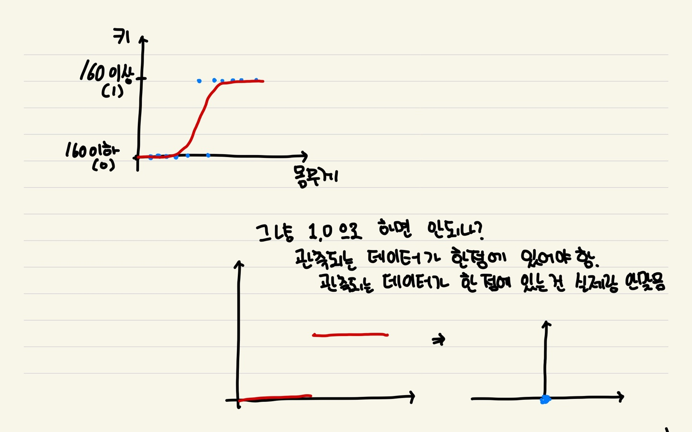

## Logistic Regression

자연은 평균으로 회귀하려는 경향이 있다. 이를 이용하면 기존의 데이터를 가지고 새로운 데이터는 어떤 값을 가질지 짐작해볼 수 있다.  

위 첫번째 그래프에서, 몸무게와 키의 데이터가 파란점과 같이 나타난다면, 간단히 일직선으로 표현해볼 수 있을 것입니다.  
일직선으로 나타난 관계를 통해, 몸무게 몇 kg 은 키 몇 cm 라고 말할 수 있을 것입니다.  

이번엔, 특정 몸무게가 160 이상인지를 판별해보도록 해봅시다. 구하려고 하는 것이 바뀌었으니, 위 두번째 그래프와 같이 표현될 것입니다.  
데이터를 정확히 표현하지 못할뿐 아니라 초록색의 새로운 데이터가 추가될 경우, 기존의 추론한 직선의 식은 그게 변할 것입니다. 또한 변경된 식또한 제대로 데이터를 표현하지 못하게 됩니다.

 

그렇다면, 어떤 그래프 모양이 분류를 잘할 수 있을까요?
위의 첫번째 그림같이 그래프를 그리면 될것입니다.  
이제 저 그래프를 통해 새로운 값을 넣어 그 값이 어디로 분류될 수 있는지 알 수 있을 것입니다.
관측된 데이터가 한점에 모여있지 않기 때문에, 그래프의 y축은 0 ~1 의 값을 가집니다.

좀 더 자세히 알아보겠습니다.  
왜 Step Function(계단 함수) 을 사용하지 않을까요?  
특정 지점을 기준으로 1/0 두개의 값을 가지게 될 경우, 관측될 데이터가 한점에 모두 모여있어야 합니다. 그래야 그 점에서 값이 점프될 것이기 때문입니다.  
모든 데이터가 한점에 모여있다는 것은 실제와 많이 맞지 않습니다.  
그러므로, 그래프는 0~1 의 값을 가져 매끄럽게 이어지게 됩니다.

