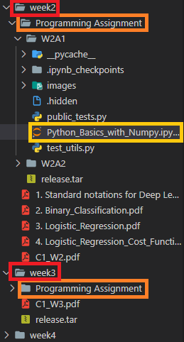
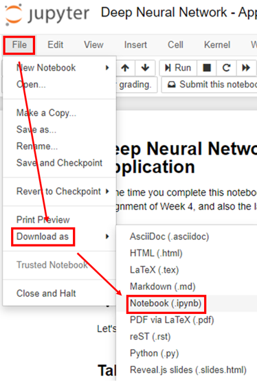
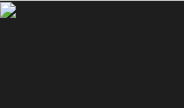
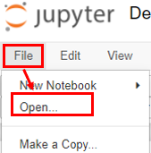
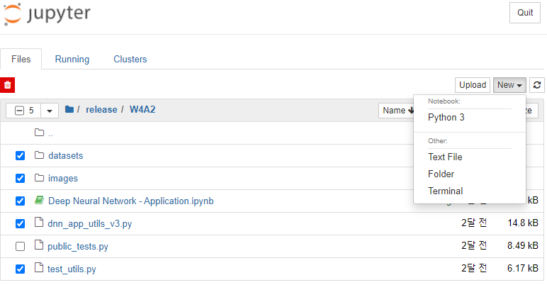
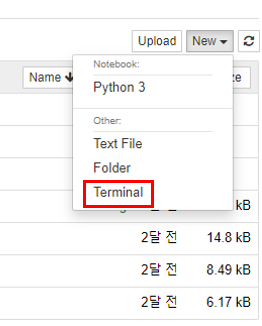
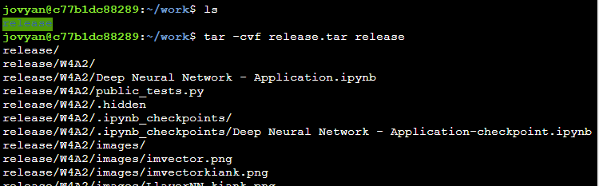
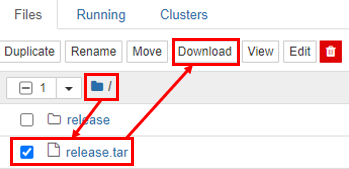

# coursera jupyter 과제 로컬에 정리

## 현재 상황 및 원하는 것  
현재 저는 Coursera 의 'Deep Learning Specialization' 를 수강하고 있습니다. 이 강의에서는 실습을 위해 웹으로 Jupyter 로 과제를 제공하고 있습니다.  
실습 과제는 courera의  여러개의 course -> 여러개의 week -> assignment 의 경로로 접근할 수 있습니다.  
week1 의 과제를 복습하고 week2 의 과제로 넘어가려면, week2 로 넘어가야 합니다. course 간의 이동은 더욱 불편합니다.   
편하게 복습하기 위해서는 스위칭을 편리하게 만들 필요가 있습니다.  

저는 vs code 를 사용하기 때문에, 아래와 같이 사용하려고 합니다.

## 문제
단순히 ipynb 파일만 다운받으면, 마크다운으로 추가한 이미지가 존재하지 않아 아래와 같이 보일 수 있습니다.    
  
다운 받은 ipynb 의 엑박.  
  

그러므로, 이미지까지 모든 파일을 다운로드해서 저장하겠습니다.

1. File -> Open 을 누릅니다.  
  

2. ipynb 파일과 그 안에 사용되는 데이터 폴더들이 보이지만 다운받을 수 있는 버튼이 보이지 않습니다.   
  

3. 우측의 New -> Terminal 을 누릅니다.  
  

4. terminal 창에 'tar -cvf release.tar release' 를 입력합니다.  
  
(ls 입력하면 release 라는 폴더가 있는것을 알 수 있습니다. release 폴더 기준으로 하위 폴더에 각 과제와 관련된 폴더들이 모두 있습니다.)

5. 뒤로가기 후, 최상위 폴더 버튼을 누르면, release.tar 이 존재합니다. release.tar 을 체크하면 Download 버튼이 뜹니다. 이를 다운받아 반디집같은 압축해제 프로그램으로 압축해제후 사용하시면 됩니다.
  

 
 
 

이제 원하시는 구조로 로컬에 정리하시면 됩니다.    
  